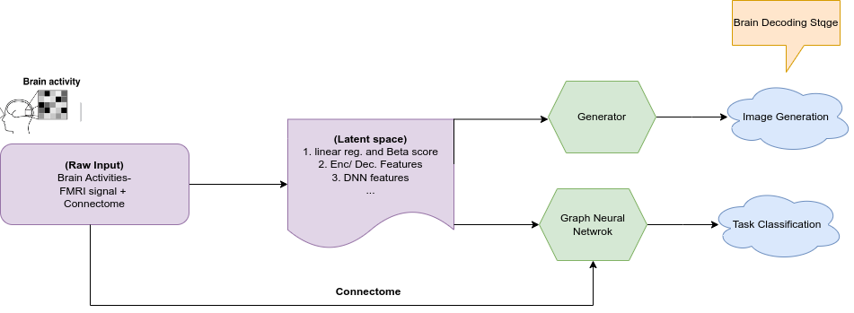

# **Brain Decoding Using Connectivity Informed Models**

This is a [the Jupyter Book](https://jupyterbook.org), for my Project during Sumer programme of [Brain Hack School](https://school-brainhack.github.io/). The project is about Brain activity and decoding (here image classification) based on Graph Neural Networks (trained by ChebNet). Following is the overall perspective of Brain decoding. Please go to the `ipynb` section for the details, and coding part of the project. 

### Brain Decoding Strategy overall view point
 

